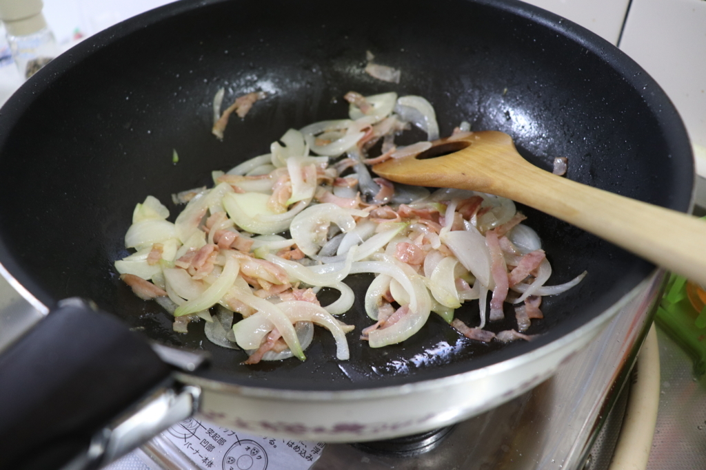
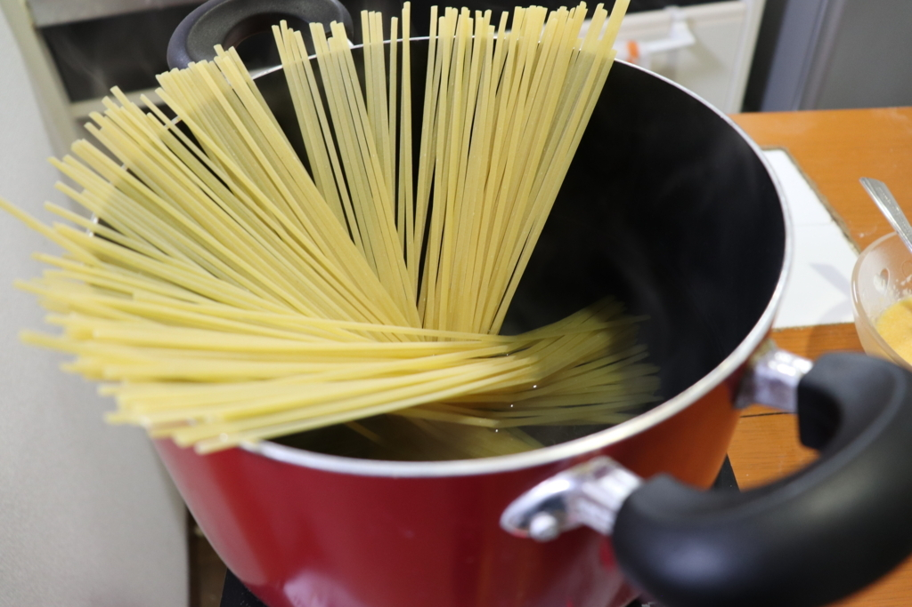
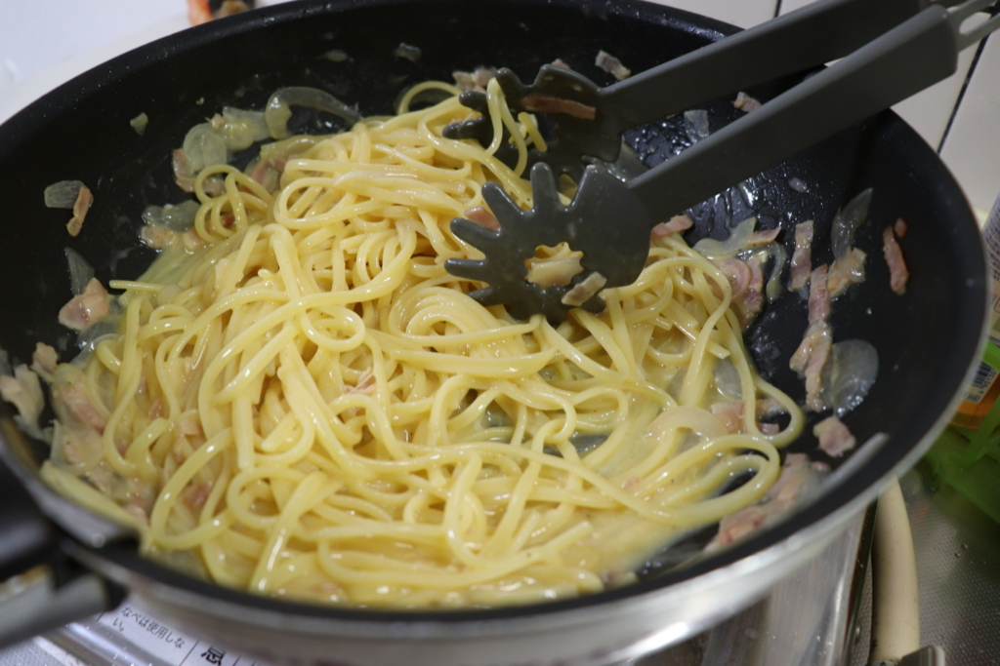
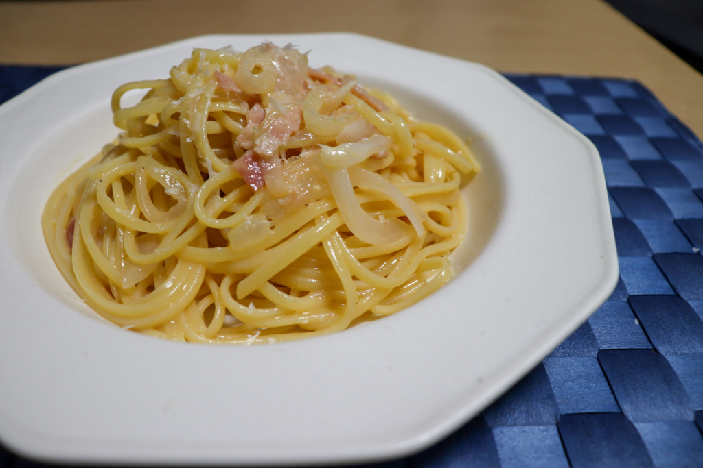

はじめまして。ざるご([@zalgo3](https://twitter.com/zalgo3))です。

自己紹介は記事の最後にするとして、早速料理の話に移ります。

カルボナーラといえば、生クリームや牛乳を使ったクリームパスタのイメージが強いと思います。

しかし、この食べ方は日本独自のもので、本場**イタリア**では、卵とチーズだけで仕上げるものが一般的です。

ぼく個人も、重すぎず、チーズの味がしっかり味わえる、このイタリア本場流の味を好んでよく作っています。

## 分量

- パスタ 200g
- パルミジャーノ・レッジャーノ 10g
- 卵 2 個
- 玉ねぎ 1/2 玉
- にんにく 1 かけ
- ベーコン 40g
- バター 10g
- ピュア・オリーブオイル 大さじ 1
- エキストラヴァージン・オリーブオイル 適量
- 塩・胡椒 適量

## 作り方

玉ねぎとベーコンを 7mm 幅くらいに切ります。にんにくは潰さずスライス。

卵とパルミジャーノ・レッジャーノを混ぜ合わせて、塩・胡椒をしておきます。

チーズは普通の粉チーズでもいいのですが、固形のパルミジャーノ・レッジャーノを削ってやると味は抜群に変わります。

お値段は少し高いですが、一度買うと結構使えるので、ぼくは一個は持っておくようにしています。

<Affiliates query="パルミジャーノ・レッジャーノ" />

<Affiliates asin="B004KULMRQ" rakutenItemCode="glv-p5:10046509" JAN="0098399450001" query="Microplane" />

それでは具材を炒めていきましょう。

フライパンにピュア・オリーブオイルとバターを入れて熱します。

**ピュア・オリーブオイル**は、普通にオリーブを絞ったオイル。それに対し、**エキストラヴァージン・オリーブオイル**は、香りや成分が一定の基準を満たしたもののみが名乗れる、特別なオイルです。

全部エキストラヴァージンを使ってもよいのですが、加熱すると香りが飛んでしまうので、材料を炒めるのにはピュアを使うことにしています。

弱火でベーコンを炒めて、色がついてきたら玉ねぎとにんにくを投入します。しんなりしてきたら火を止めましょう。

具材を炒めるのと同時並行で、パスタを茹でておきます。

パスタはディチェコのリングイーネを使用しました。

アルデンテという言葉があるように、パスタはコシがとても大事です。

イタリアの人気ブランド、ディチェコは、低温で時間をかけて乾燥させているので、茹でるとパスタの外側から少しずつ柔らかくなり、程よいコシを出すことができます。

個人的にすごく好きなメーカーです。

<Affiliates asin="B01B11O36I" JAN="8001250002419" query="ディチェコ リングイーネ" />

ここからが**重要なポイント**です。

標準茹で時間の 2 分ほど前に、パスタを具材の入ったフライパンにあげます。ここで、**茹で汁を切らない**ことが大事です。

再度火をつけ、パスタと具材を、**茹で汁を加えながら**混ぜ合わせていきます。この作業で、オイルと茹で汁が乳化し、まろやかな味を作ることができます。

適宜パスタの硬さを確認し、アルデンテ(程よい芯が残った硬さ)になったら火を止め、最初に混ぜ合わせた卵とチーズを加えて混ぜ合わせます。

香り付けにエキストラヴァージン・オリーブオイルを加えて混ぜ合わせ、お皿に盛ってパルミジャーノ・レッジャーノ(分量外)をかければ完成です。

