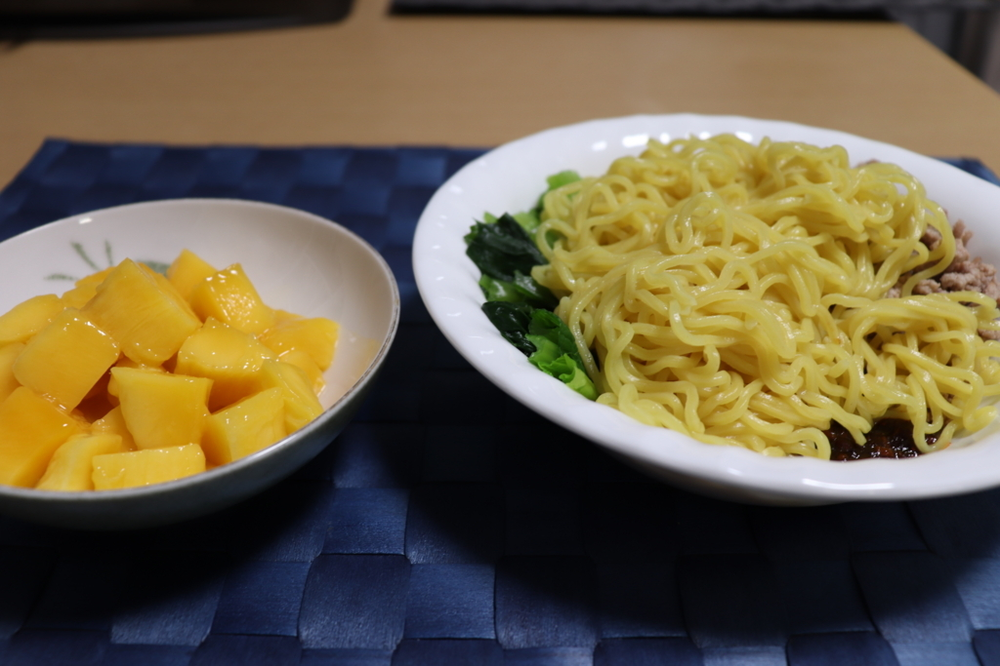
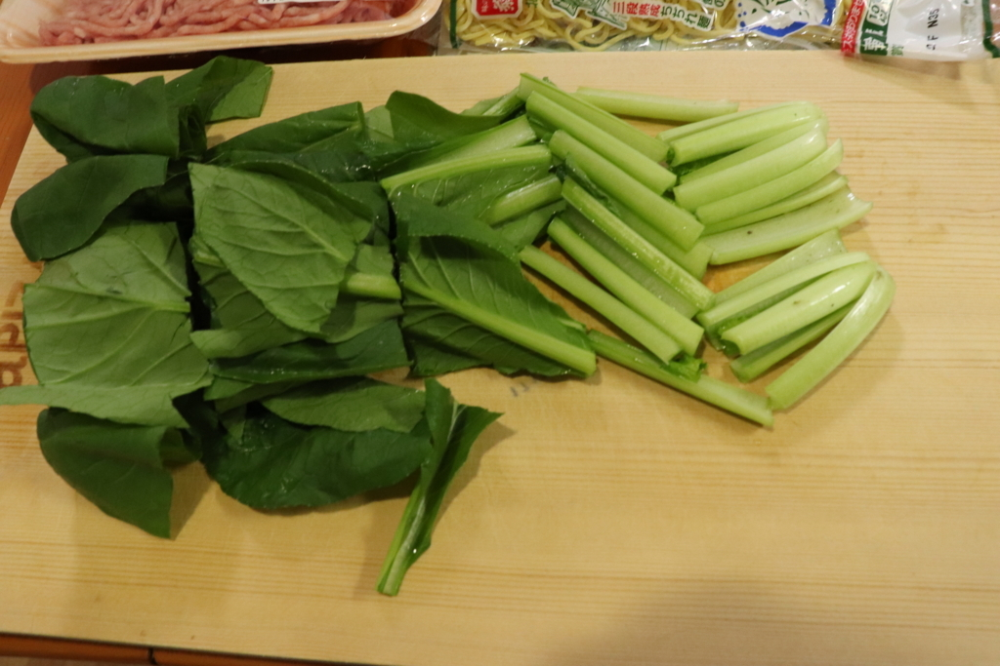
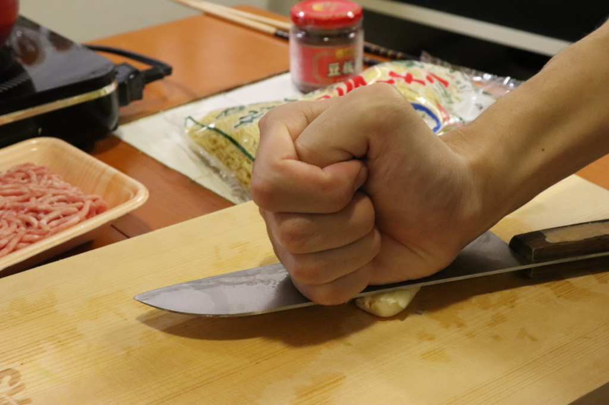
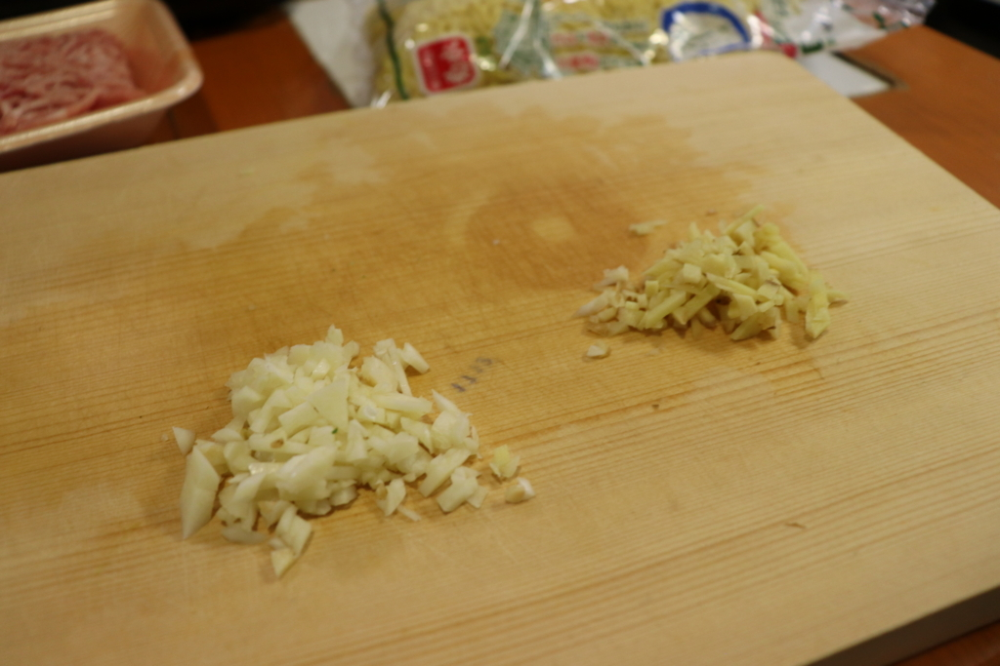
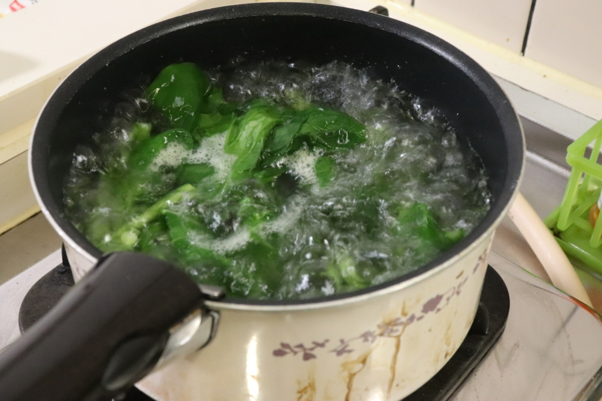
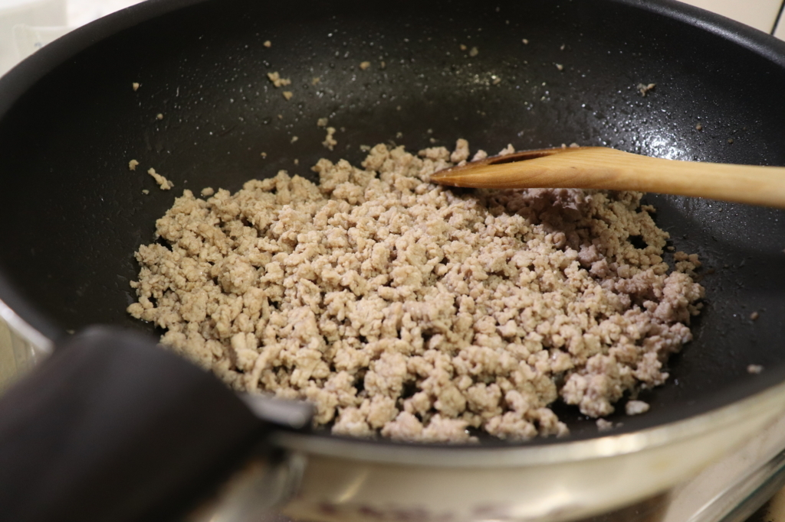
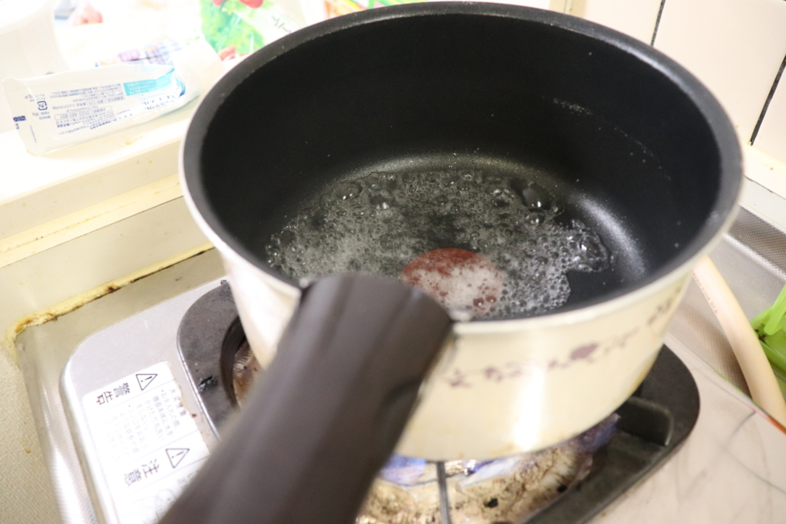
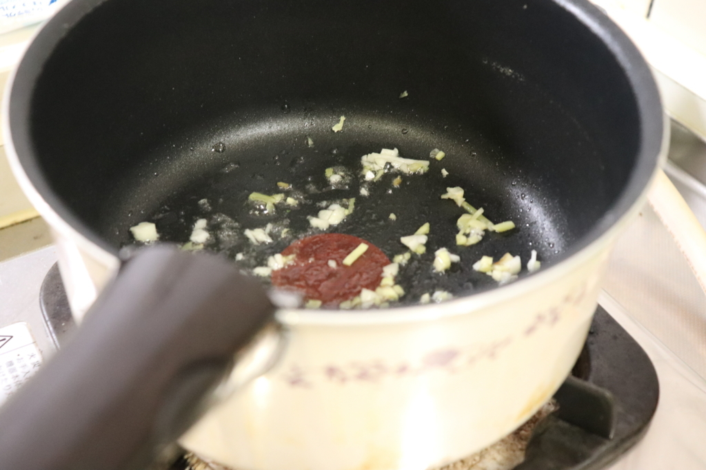
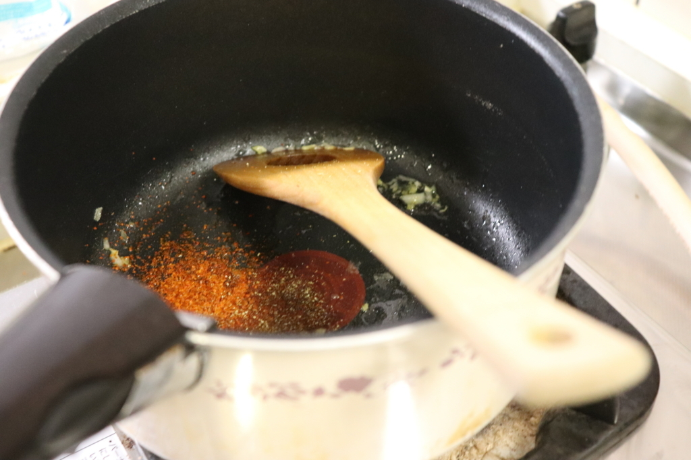
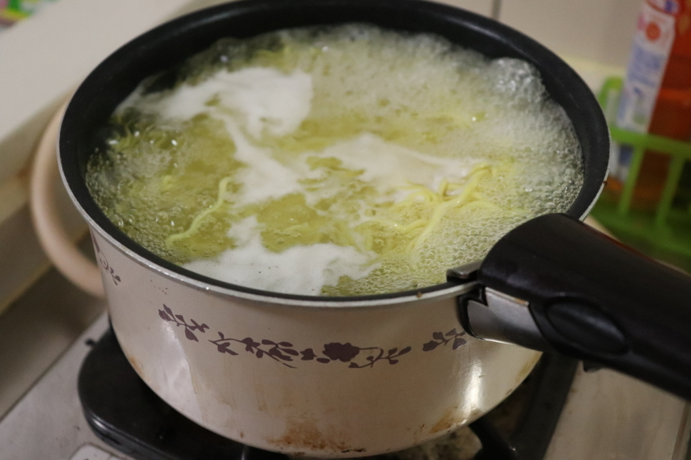

こんにちは。ざるご([@zalgo3](https://twitter.com/zalgo3))です。

今回は、伝説の料理、「パンツマンの汁無し坦々麺」の作り方です。

## 3 人前の分量

-   豚ひき肉 200-250g
-   小松菜 3 株
-   中華麺 3 玉
-   にんにく 1 かけ
-   しょうが 1 かけ
-   サラダ油 大さじ 2 分の 1
-   みりん 大さじ 1
-   酒 大さじ 1
-   味噌 大さじ 1
-   豆板醤 大さじ 1
-   オイスターソース 小さじ 1
-   穀物酢 大さじ 2 分の 1
-   醤油 大さじ 2 分の 1
-   一味唐辛子 適量
-   山椒 適量
-   ラー油 適量

### 作り方

まず野菜を切っていきます。

小松菜を 5 センチ幅に切ります。

にんにくを潰してみじん切りにします。

**親の仇プレス！**

生姜は皮を向いてみじん切りにします。

鍋でお湯を沸騰させ、小松菜を 1 分ほど茹でます。

この際、火が通りにくい茎の方から先にお湯に入れるように注意しましょう。

茹で上がったらお湯を切っておきます。

フライパンに少量のサラダ油（分量外）を熱し、ひき肉を炒めます。

パラパラになったら火を止めておきます。

ここからソースを作っていきます。

このソースがほんとに神で、入れすぎた調味料があってもしょっぱくなったり甘すぎたりすることが絶対にありません。

**秘伝南伝**

まずはみりんと酒を加熱してアルコールを飛ばします。

みりんには砂糖が含まれていて、あんまりやりすぎると焦げてしまうので注意。

つづいて同じ鍋にサラダ油、生姜、にんにくを入れて炒めます。

次に一味唐辛子と山椒を加えます。

たっぷり加えて激辛にするのもよし、控えめにして甘口にするのもよし。

加熱しながら、味噌、豆板醤、オイスターソース(なくても可)、穀物酢、醤油を順番に加えていきます。

ひと煮立ちさせたらソースの完成。

中華麺を茹で時間通りに茹でます。

茹であがったら水を切っておきます。

ソース、小松菜、ひき肉、中華麺をお皿に盛り付ければ完成です。

↓ マンゴーが安かったのでデザートとして添えています。

辛いラー油をたっぷりかけて、よくかき混ぜて食べましょう。

これがなかなか混ざりにくい！

でも

**オッカラ ☆ カラリラ**

https://www.nicovideo.jp/watch/sm19095885
