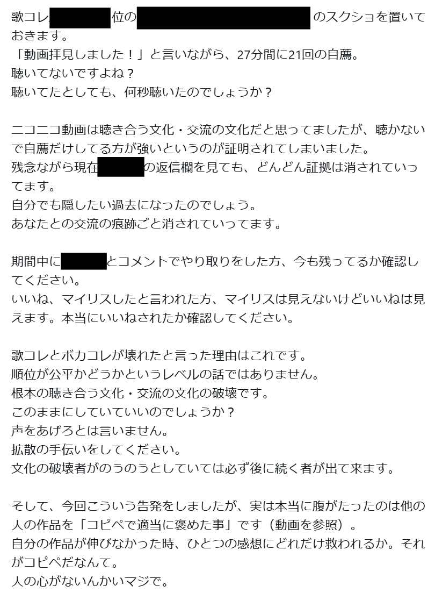

## この記事を書いたきっかけ

この記事では、ニコニコ動画のイベント「**ボカコレ**」「**歌コレ**」「**踊コレ**」で広く蔓延しているであろう、**_いいねを増やすための手法_**を紹介します。

ここで紹介する手法は、明示的に規約違反などにはあたらないものの、自然に発生するよりも遥かに大きい数字を叩きだしてしまう可能性のある「**ハック**」**的な手法**です。

そのような手法を紹介するきっかけとなったのは、以下のようなポストを見かけ、このポストに賛同する人が多いことを観測したことです。（執筆時点で366いいね）

特定個人を批判する意図はないため、個人名にあたる部分は黒塗りとしています。

上のポストでは*なりふり構わぬ自薦*が取り沙汰されていますが、その他の手法についても紹介していきます。

## 1. 自薦

**自薦**とは、XなどのSNS上で、「私の動画を見てください」と、URLを送りつけて見てもらう行為のことを言います。

ボカコレ等のイベントでは、**ニコニコ動画でのリアクションを交換条件とする自薦は禁止されています**が、自薦行為自体は禁止されていません。

> https://vocaloid-collection.jp/caution/
>
> **投稿者同士で楽曲を聞き合うことや、自らの作品を推薦することはボカロ文化を楽しむ行為の一環**であるとボカコレ運営は考えております。
> しかしながら、投稿作品の内容に関係なく交換条件によってランキングの数値を得る行為は、ボカコレの本来の趣旨とは外れたものであると考えております。
>
> 『ボカロにまつわる人々が参加し、ボカロ文化を楽しむ祭典』というボカコレの本来の趣旨をご理解いただき、**交換条件で投稿作品のリアクション数を増加させる行為はお控えください。**

ちなみに、「ニコニコ動画でのリアクションを交換条件とする自薦」を禁止する文言は昔は存在しておらず、そのような行為がSNSで蔓延していることに対する批判が増えたため、このような文言が追加されました。

しかし、現在でも実質的にはこれに近い趣旨の自薦は行われており、それが記事冒頭で紹介したポストのような類のものとなります。

人間の心理には「人が他人から何かしらの恩恵を受けた場合、その恩恵に対して何らかの形でお返しをしたくなる」という傾向があることが知られています。これを**返報性の原理**と呼びます。

「動画見ました」とか「いいねしました」などと言われたうえで動画を自薦されると、_一定割合の人はお返しとして「いいね」等のリアクションをしたくなってしまいます_。

特に、ニコニコ動画の場合はいいねが投稿者に通知されるので、逆に言えば*いいねをしなかったらしなかったことが相手にバレてしまいます*。これも自薦をされたときにいいねを返さなければいけないという心理につながるでしょう。

明示的にニコニコ動画でのリアクションを交換条件としなくても、返報性の原理とニコニコ動画の仕様を鑑みると、**そもそも自薦自体がそもそも交換条件を暗黙的に内包してしまう**と言えるでしょう。

これを利用したハックとして、**_絨毯爆撃的に何百件何千件と自薦を送れば_**、そのうちのそれなりに高い割合がいいねを返してくれ、非常に多くのいいねを稼ぐことができてしまいます。

ただ、これをいわゆる純粋に「_この人に聴いてほしい_」*という気持ちで行う自薦と区別することは難しい*という問題があります。

上のポストのように「動画長より遥かに短いペースで聴きましたとリプを送っている」ような事象が表に出ればようやく違和感を感じる人も増えるでしょうが、それほど目立つケースではないものも多く存在していることでしょう。

## 2. 自薦募集

返報性の原理とニコニコ動画の仕様により自薦は暗黙的に「ニコニコ動画でのリアクション」を交換条件としてしまいがちという話を上に書きましたが、つまり自薦する側と全く同様のロジックで、**自薦募集**する側にも「いいね」等がつきやすいという現象が起こります。

自薦募集をすれば、そこにリプされる自薦の中には一定割合、暗黙的に「**いいねするからいいねを返してほしい**」という意図のものが含まれます。

仮に最終的に自薦募集した側からはいいねを返さなかったとしても、**自薦募集をした時点でそういった人たちからのいいねを稼ぐことができてしまう**というからくりが生まれてしまいます。

一方で、ボカコレ等のイベントでは投稿されている作品数が異様に多いので、自薦募集してそこに来たものから聴きたいという心理も当然に発生します。そのため、純粋な目的でも自薦を募集するケースは多いはずです。

**_いいねを稼ぐ目的の自薦募集と、純粋な目的の自薦募集と区別することはほぼ不可能だと思います。_**

## 3. 自発いいね

ニコニコ動画では、動画にいいねをつけると、誰がいいねをしてくれたかが投稿者に通知されます。

つまり、ここでも**返報性の原理**が活躍します。「**いいねされたからいいねを返さなきゃ**」という心理が働くのです。

もちろん動画投稿者間の個人的なつながりとしていいねをし合うという関係性が生まれることもありますが、これもやはりハックの対象になり得ます。

**_何百何千といいねを送りつけていけば_**、そのうちの一定割合はいいねを返してくれるので、やはり大量のいいねを稼ぐことができてしまいます。

自薦や自薦募集は議論のやり玉にあがることが多いですが、この**自発いいね**に関してはあまり議論になっているところを見ません。

これは、SNSでの公開ポストによって行われる自薦と違い、**ニコニコ動画上のいいねは他の人からは誰がやっているかわからない**というのが理由だと思います。

実際には、この手法も暗躍しているのではないかと推測しています。

## おわりに

今回、3つの手法を紹介したわけですが、これらの手法は**必ずしも悪い側面ばかりではありません**。

例えば自薦に関して言えば、自薦をする文化が根付いているおかげで、*あこがれの投稿者に自分の動画を見てもらえるチャンス*も広がります。

実際私も、何年も前からあこがれていた歌い手さんに自分の歌ってみたを送りつけて、聴いてもらった上にフォロー返しをいただいたという経験もあります。歌コレと自薦文化がなければこのような経験は怒らなかったことでしょう。

また、仮に「ハック」であったとしても、ルールとして許容されており、コミュニティでも大きく批判の対象となっていないのであれば、それは「**正当な努力**」**として正当化されるべき**という考えもあると思います。

ニコニコ動画はユーザーの自治によって発展してきたサイトです。なのでニコニコ動画上で行われているイベントがどのような方向に進むかも、結局は**_それに参加しているユーザーや見ているユーザーの総意によって決まるべき_**であると考えています。ユーザーがハックを努力として認めるのであれば、それはイベントとしても認めていくべき行為ということになるでしょう。

ただし、**そもそもハックが存在していること自体知らない人が多いとしたら、それは不公平さにも繋がる**と思いますので、今回このような記事を書かせていただきました。

この記事を読んで何かを感じたり感じなかったり、行動を変えたり変えなかったり、拡散したりしなかったりしていただければ幸いです。

## 宣伝

歌コレ2025秋でざるごも動画を投稿していたので、見ていって頂ければ嬉しいです。

もちろんいいねも大歓迎ですが、**いいねは返しません！！**

<NicoNicoEmbed videoId="sm45350970" title="【歌ってみた】ワールド・ランプシェード [reunion] / buzzG【ざるご】" />

<NicoNicoEmbed videoId="sm45400045" title="【オリジナルMV】STORM 2021 / JAM Project【京大卒3人で歌ってみた】" />
